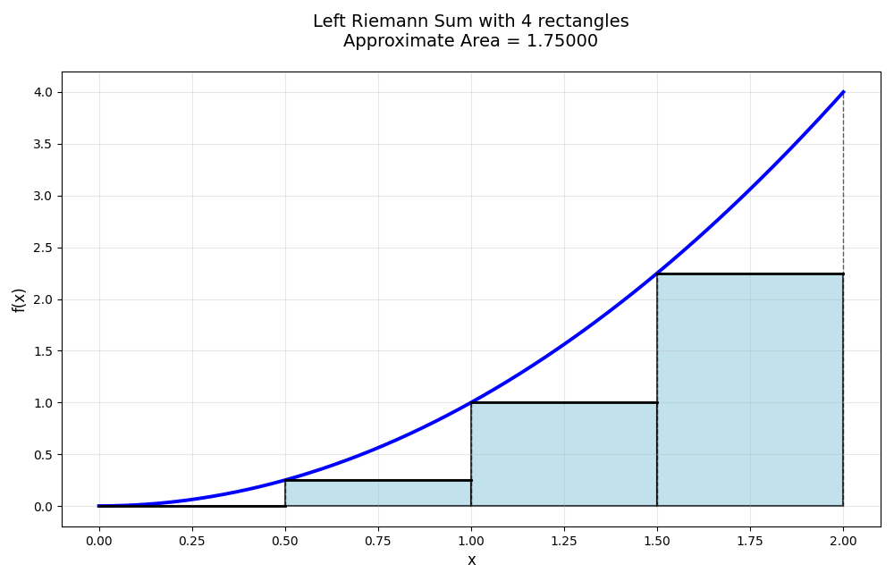
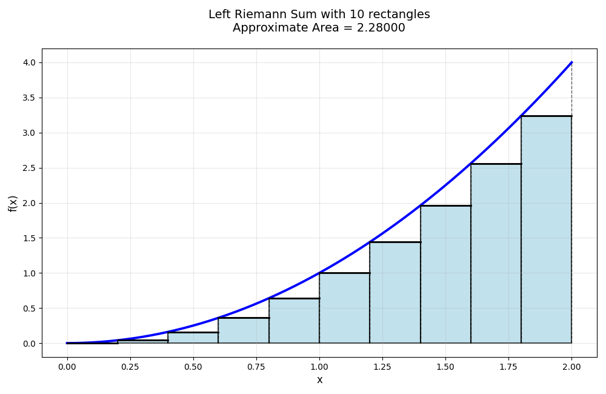
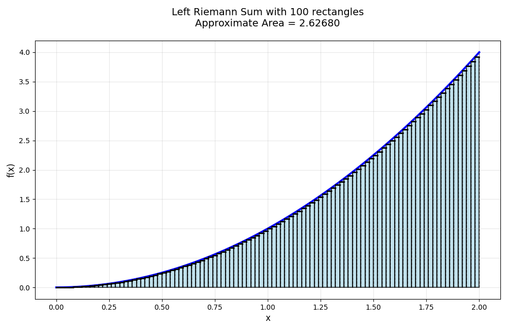
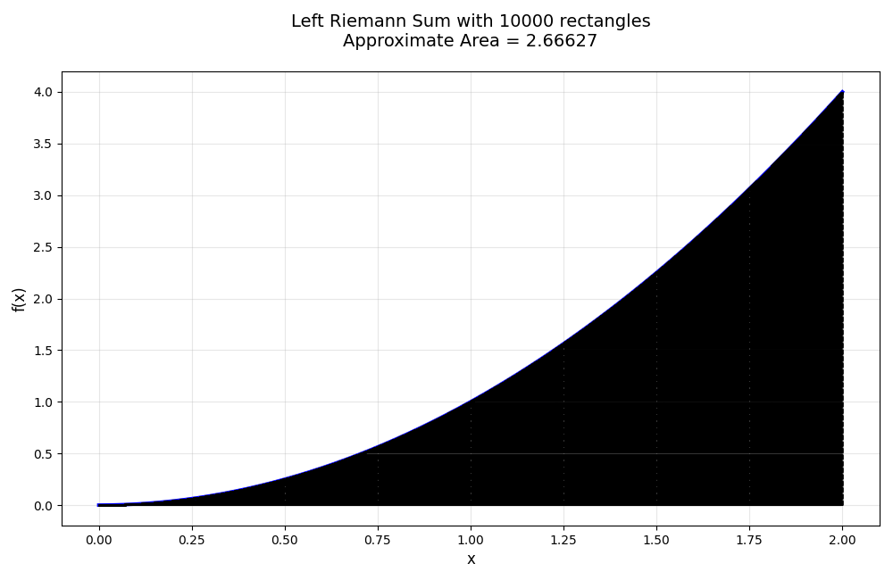

# General Instructions

Like always, each Lab should have the following header:
```
"""
Author: Your Name
Date: Today's Date/Due Date
FileName: The File's Name
Purpose: What the program is about
"""
```

## Lab 5a: Mood Playlist Generator

Suppose its finals week at UOG, and the stress is lowkey real. You just finished a CS201 exam (that you totally did great on) in the Student Success Center (because its take home... we will talk about it later), and the pressure is as if you are lifting the earth. Depending on your mood right now whether you have aced your test or are completely drained, you want to listen to the perfect set of music.

But you're too tired to hunt through Spotify. Its okay, lets make a program to pick for you!

You will make a program called `mood_generator.py` that will do the following:

- Stores a collection of popular pop songs organized by mood using a **dictionary**. The dictionary is structured where your keys are the moods and the values are a list of songs. Below is an example (you may use it as well)
```
mood_to_songs = {
    "happy": ["APT. - ROSÉ & Bruno Mars", "Espresso - Sabrina Carpenter"],
    "chill": [],
    "angry": [],
    "sad": [],
    "focus": [],
    "island vibe": []
}
```
- Asks the user to input their current mood (happy, chill, angry, sad, focus, or island vibe).
- Recommends 3 randomly selected songs from that mood’s list (no duplicates in one recommendation).

Note: You need a minimum of 3 moods, each with 5 songs to randomly choose. You are not limited to the amount of songs or moods, don't go overboard though.

Recommended functions/operations: `random.sample()`, `for key in mood_to_songs.keys():`

## Lab5b: Destroying a pyramid!

A followup from Lab3a, lets build upon this project.

Update your existing `create_pyramid.py` program (from Lab 3a) so that it:

- Still asks the user for the number of rows (height) of the pyramid.
- Builds the full pyramid as a list of strings (each string = one row of the pyramid).
- Then asks the user: “Which rows do you want to destroy? (enter numbers separated by commas)”
- Removes the chosen rows from the list.
- Finally prints the surviving (modified) pyramid, nicely centered.

Note: You may assume that the user will enter the removed rows in order.

Example:
```
Hello user, lets create a pyramid!
How many rows will this pyramid have (blocks tall): 11
           🧱
          🧱🧱
         🧱🧱🧱
        🧱🧱🧱🧱
       🧱🧱🧱🧱🧱
      🧱🧱🧱🧱🧱🧱
     🧱🧱🧱🧱🧱🧱🧱
    🧱🧱🧱🧱🧱🧱🧱🧱
   🧱🧱🧱🧱🧱🧱🧱🧱🧱
  🧱🧱🧱🧱🧱🧱🧱🧱🧱🧱
 🧱🧱🧱🧱🧱🧱🧱🧱🧱🧱🧱
Great pyramid!
What rows would you like removed?: 3,6,10
           🧱
          🧱🧱
        🧱🧱🧱🧱
       🧱🧱🧱🧱🧱
     🧱🧱🧱🧱🧱🧱🧱
    🧱🧱🧱🧱🧱🧱🧱🧱
   🧱🧱🧱🧱🧱🧱🧱🧱🧱
 🧱🧱🧱🧱🧱🧱🧱🧱🧱🧱🧱
It...uhm... looks great!
```

Recommended Functions/Methods: You can put the rows into a 1D list of strings! Then use `.pop()` to remove the specific rows. Remember that once you pop, the size of the list changes, so think of ways to account for the changing size! Otherwise, you may remove the incorrect rows!

## Lab 5c: [Part 1] RPG Level up and and use item manager

RPG stands for Role-Playing Game. In an RPG, you take on the role of a character "class" (like a Warrior, Mage, or Rogue) and go on adventures. 

Your character has stats (like strength, health, and level), gains experience points (EXP), encounter and defeat enemies, and levels up to become stronger. 

You can also collect and use items (like apples or health potions) to heal yourself during battles. 

The goal is to make strategic decisions like which stat to increase when you level up, or when to use a healing item during battle to defeat enemies and progress through the game.

Throughout this lab, you will create a simple RPG by creating functions that handles the following:
- A function that handles leveling when a player levels up
- A function for using items in battle
- A function for random encounters
- A function that handles combat (simplified)

For Part 1, you will do the first two, and for Part 2, you will do the last two. 

The player will be the following dictionary. Please use this when testing your functions.
```
player = {"class" : "Warrior", 
          "level" : 20,
          "current_exp" : 1374,
          "health" : 520,
          "attributes" : [10, 4, 2, 9, 6, 7], # STR, INT, DEX, VIT, CON, CHR
          "inventory" : [["apple", 10], ["health potion", 3], ["key", 1], ["stick", 1]]}
```

##### Function one, `level_manager(player)`
The first function relates with the leveling system. Lets call it `level_manager(player)` where player is a dictionary.
- Check if the player is close to leveling up by checking thier current exp. 
- If their exp is over the the exp to next level:
  - Subtract the current exp by the exp to next level 
  - Level up the character, then prompt the user to ask what attribute they want to level up by one point!

To keep track of levels and when they level up, please use this formula:
EXP_TO_NEXT_LVL $= 100 × 1.3^{(level-1)}$

Here is a sample:
```
Level up! You are now level 21!
Current attributes: STR=10, INT=4, DEX=2, VIT=9, CON=6, CHR=7
Which attribute would you like to increase? (STR/INT/DEX/VIT/CON/CHR): STR
STR increased to 11!
```

Extra Credit (5pts): Handle cases when the player levels up more than once. 

##### Function two, `use_item(player, item_name)`
This function allows the player to use items from their inventory:

To make things simple, lets only look at two items
Item effects:
- `"apple"`: Restore 50 health (cannot exceed max health)
- `"health_potion"`: Restore 100 health + 10% of their max health (cannot exceed max health)

During combat, if a player uses an item, update the count of said item accordingly and return a message describing what happened. 

If there is zero of the item, tell the user they cannot use the item, they don't have any. 

For example:
```
# Assuming max_health = 520 and current health is 400
use_item(player, "apple")
# Returns: "Used apple! Restored 50 HP. Current health: 450/520"

use_item(player, "health_potion")  
# Returns: "Used health potion! Restored 152 HP. Current health: 520/520"
``` 

## Lab 5d: Calculus Numerical Intergration 

In Calculus I, the definite integral \(\int_a^b f(x) \, dx\) represents the **area under the curve** of a function \(f(x)\) from \(x = a\) to \(x = b\).

We use integration in real life for things like calculating total distance traveled from velocity, total work done, or accumulated rainfall.

However, there are many functions that are hard to integrate by hand. For example, something as "simple" as $\int_a^b e^{x^2} dx$ doesn't have elementary functions to integrate this. Hence we use **numerical methods** to approximate the area.

In this lab, you will use the **Left Riemann Sum** (also called Left Rectangle Method). This is one of the simplest ways to approximate the area under a curve.

Here is the basic rundown:
- We split the interval from `a` to `b` into `n` equal parts.
- For each part, we draw a **rectangle**.
- The **width** of each rectangle is $\Delta x = \dfrac{b - a}{n}$.
- The **height** of each rectangle is the value of the function at the **left** side of that interval only. For left Riemann, it would be $f(x_{i - 1})$
- Then we get all left side x points of the rectangle.
- We calculate the area of each rectangle (`width × height`) and add them all up.

So for example, suppose we wanted to find the area under the curve of $f(x) = x^2$ between $x = 0$ and $x = 2$.

The formula for reimann sum is:

$$ \sum_{i = 1}^n f(x_i^*) \cdot \Delta x_i $$

Where $x_i^*$ is the type of reimann sum. Since we are doing left, we have $x_i^* = x_{i - 1}$.

If we decided to create 4 subdivisions (4 rectangles) we have the following:

$$
\begin{aligned}
\sum_{i = 1}^4 f(x_i^*) \cdot \Delta x_i &= \Delta x_i \cdot \sum_{i = 1}^4 f(x_{i - 1}) \\
&= \Delta x_i \cdot \Big(f(x_0) + f(x_1) + f(x_2) + f(x_3)\Big) \\
&= \dfrac{1}{2} \Big(f(0) + f(0.5) + f(1) + f(1.5) \Big) \\
&= \dfrac{1}{2} \Big(0^2 + 0.5^2 + 1^2 + 1.5^2 \Big) \\
&= \dfrac{1}{2} \Big(0 + 0.25 + 1 + 2.25 \Big) \\
&= \dfrac{1}{2}(3.5) = 1.75
\end{aligned}
$$

We get the following figure:



Notice that its not a very good approximation as we are missing a lot of the area under the curve. To get a more accurate result, you would create more subdivisions!

If we decided for $n = 10$:
$$\Delta x = \dfrac{2 - 0}{10} = \dfrac{1}{5} = 0.2$$

$$x = [0, 0.2, 0.4, 0.6, 0.8, 1.0, 1.2, 1.4, 1.6, 1.8, 2.0]$$

where $x_0 = a = 0$ and $x_{10} = b = 2$

$$
\begin{aligned}
\sum_{i = 1}^{10} f(x_i^*) \cdot \Delta x &= \Delta x \cdot \sum_{i = 1}^{10} f(x_{i - 1}) \\
&= \Delta x \cdot \Big(f(x_0) + f(x_1) + f(x_2) + f(x_3) + f(x_4) + f(x_5) + f(x_6) + f(x_7) + f(x_8) + f(x_9)\Big) \\
&= \dfrac{1}{5} \Big(f(0) + f(0.2) + f(0.4) + f(0.6) + f(0.8) + f(1.0) + f(1.2) + f(1.4) + f(1.6) + f(1.8) \Big) \\
&= \dfrac{1}{5} \Big(0^2 + 0.2^2 + 0.4^2 + 0.6^2 + 0.8^2 + 1.0^2 + 1.2^2 + 1.4^2 + 1.6^2 + 1.8^2 \Big) \\
&= \dfrac{1}{5} \Big(0 + 0.04 + 0.16 + 0.36 + 0.64 + 1.00 + 1.44 + 1.96 + 2.56 + 3.24 \Big) \\
&= \dfrac{1}{5} (11.4) = 2.28
\end{aligned}
$$

Below is the figure for the following result:



As you can see, a much more accurate result! Still quite rough...

Now that you got the basic idea, the theory is that if we keep increasing n, we get a more accuracte result to the area. 

If we did $n = 100$:



We almost get the entire area under the curve.

Eventually, if we do a big number like $n = 10000$, it should emcompass the entire area under the curve:



Note that this is an approximation such that: 

$$ \sum_{i = 1}^n f(x_i^*) \cdot \Delta x_i \approx \int_a^b f(x) dx = F(b) - F(a)$$

If we do the actual integral, we assume to take an "infinite" summation. So our $n = \infty$. This becomes the following:

$$ \sum_{i = 1}^{\infty} f(x_i^*) \cdot \Delta x_i \approx \int_0^2 x^2dx = \dfrac{x^3}{3} \Big|_0^2 = \dfrac{2^3}{3} - \dfrac{0^3}{3} = \dfrac{8}{3} \approx 2.667$$ 

With the main idea down, your task is to create a program called `numerical_integration.py` that does the following:

- Asks the user for the `formula` they want to integrate (Note: They need to write it in python syntax)
- Asks the user for the lower bound `a` and upper bound `b`
- Asks the user for the sub divisions `n`
- Calculate $\Delta x = b - a / n$
- Create a list of left endpoints: x\_left $= [a, a + \Delta x, a + 2\Delta x, ...]$
- Create a list of y-values (the height) by evaluating `f(x)` at each endpoint
- Create a list of areas of each rectangle by evaluating $\Delta x \cdot $ y_values$[i]$
- Return the approximate area by summing all the rectangles along with the lists of left endpoints, y_values, and areas of each rectangle.

Example Output: 
```
Please insert formula: x**2
Enter lower bound a: 0
Enter upper bound b: 2
Enter sub divisions n: 10
x_points: [0.0, 0.2, 0.4, 0.6, 0.8, 1.0, 1.2, 1.4, 1.6, 1.8]
y_points: [0.0, 0.04, 0.16, 0.36, 0.64, 1.0, 1.44, 1.96, 2.56, 3.24]
rectangle areas: [0.0, 0.008, 0.032, 0.072, 0.128, 0.2, 0.288, 0.392, 0.512, 0.648]
Approximate area: 2.28
```

For this lab, please use the following template below:
```
def numerical_integration(f, lower_bound, upper_bound, sub_divisions):
    """
    Calculate the Left Riemann Sum approximation.
    
    Returns: [area, x_points, y_points, rectangles]
    """
    # Step 1: Calculate the width of each rectangle
    # TODO: Compute delta_x = (b - a) / n
    delta_x = 0
    
    # Step 2: Create list of left endpoints (x_points)
    # TODO: Compute x_points
    x_points = []
    
    # Step 3: Calculate y-values by evaluating f at each x_point
    # TODO: Compute y_points based on x_points
    $ Hint: Since f is a formula, you can do f(x_point)
    y_points = []
    
    # Step 4: Calculate area of each rectangle (width × height) 
    # TODO: Compute rectangle areas
    rectangles = []
    
    # Step 5: Sum all rectangle areas to get total approximation
    total_area = sum(rectangles)
    
    # Step 6: Return all data as a list
    return [total_area, x_points, y_points, rectangles]


# ============================================================
# TESTING CODE (Do not modify below)
# ============================================================
if __name__ == "__main__":
    # Run the test first
    test_with_known_function()
    
    # Then get user input for custom function
    print("="*50)
    print("CUSTOM FUNCTION INTEGRATION")
    print("="*50)
    
    formula = input("Please insert formula (use x, e.g., x**2): ")
    lower_bound = int(input("Enter lower bound a: "))
    upper_bound = int(input("Enter upper bound b: "))
    sub_divisions = int(input("Enter sub divisions n: "))
    
    # Create function from user input
    user_function = lambda x: eval(formula)
    
    # Calculate approximation
    result = numerical_integration(user_function, lower_bound, upper_bound, sub_divisions)
    
    # Display results
    print("\n" + "-"*50)
    print(f"x_points: {result[1]}")
    print(f"y_points: {result[2]}")
    print(f"Rectangle areas: {result[3]}")
    print(f"\nApproximate area: {result[0]}")
    print("-"*50)
```

### Lab 5d Hints:
---

To create a list of your left end points, the general sequence is $[a, a + \Delta x, a + 2\Delta x, ...]$

The number of left end points is the number of subdivisions and how far apart is based on $\Delta x$.

Assuming you already calculated $\Delta x$ and stored it in some variable, creating the left end points is as follows:
```python
left_end_points = []
for i in range(sub_divisions):
  left_end_points.append(lower_bound + (i * name_of_delta_x))
```

So from our previous example, if we did $x^2$, from 0 to 2. We have $\Delta x = \dfrac{1}{2}$, then on our for loop we have the following:

$[0 + 0 \cdot \frac{1}{2}, 0 + 1\cdot \frac{1}{2}, 0 + 2 \cdot \frac{1}{2}, 0 + 3 \cdot \frac{1}{2}]$ = $[0, 0.5, 1, 1.5]$

Then you can use your list of left_end_points to calculate the y_points (height), then use the list of y_points and multiply it by $\Delta x$ to get the area of each rectangle.

---

Note that `f` parameter for the function is using lambda. The idea is that we are treating `f` as a mathematical function.

For example:
```python
my_function = lambda x : eval("x + 3")
```

To use this function, we do the following:
```python
print(my_function(3)) # 3 + 3 = 6
```

So to evaluate your function, you can do `f(x_value)` in your function (this is helpful for getting our y points).

---
## Lab 5e: Typhoon Tracker!

You're a meteorologist working at the National Weather Service in Guam. Your job is to check if there's enough ocean energy for a typhoon to form near Guam. If there is, you need to warn the island!

GPI (Genesis Potential Index) is a score from 0-100 that tells you how likely a typhoon is to form:

Below is the ranges of GPI:

| GPI Range | Risk Level | Color | Meaning | Action Required |
|-----------|------------|-------|---------|-----------------|
| **0-20** | Very Low | 🔵 Blue | No typhoon formation expected | None |
| **21-40** | Low | 🟢 Green | Very unfavorable conditions | Monitor once daily |
| **41-50** | Moderate-Low | 🟡 Yellow | Slightly favorable | Monitor every 12 hours |
| **51-60** | Moderate | 🟠 Orange | Favorable conditions | Monitor every 6 hours |
| **61-70** | Moderate-High | 🟤 Brown | Very favorable | Issue advisory |
| **71-80** | High | 🔴 Red | Highly favorable | Issue warning |
| **81-90** | Very High | 🟣 Purple | Extremely favorable | Issue alert |
| **91-100** | Extreme | ⚫ Black | Almost certain formation | Emergency notification |

Given the following GPI 2D list, your job is to print the grid of colors for the GPI. Note that Guam is in column 4, row 5, so instead of the color, please put 🏝️ instead.

```
gpi_grid = [
    [15, 18, 22, 25, 28, 30, 32, 28, 24, 20],  # 0°N
    [18, 22, 28, 32, 35, 38, 40, 36, 30, 25],  # 3.3°N
    [22, 28, 35, 40, 45, 48, 50, 45, 38, 32],  # 6.7°N
    [28, 35, 42, 48, 55, 58, 60, 55, 45, 38],  # 10°N
    [32, 40, 48, 55, 65, 68, 70, 65, 55, 45],  # 13.3°N (Guam row!)
    [35, 45, 55, 62, 72, 78, 80, 75, 65, 55],  # 16.7°N
    [38, 48, 58, 68, 78, 85, 88, 85, 75, 62],  # 20°N
    [35, 45, 55, 65, 75, 80, 82, 80, 70, 58],  # 23.3°N
    [30, 38, 48, 58, 68, 72, 75, 72, 62, 52],  # 26.7°N
    [25, 32, 40, 48, 55, 58, 60, 58, 50, 42]   # 30°N
]

longitudes = [124, 131, 137, 144, 151, 157, 164, 171, 177, 180]  # °E
```

When mapping the colors, you should get the following:
```
       120E 127E 133E 140E 147E 153E 160E 167E 173E 180E
    0N  🔵   🔵   🟢   🟢   🟢   🟢   🟢   🟢   🟢   🔵
  3.3N  🔵   🟢   🟢   🟢   🟢   🟢   🟢   🟢   🟢   🟢
  6.7N  🟢   🟢   🟢   🟢   🟡   🟡   🟡   🟡   🟢   🟢
   10N  🟢   🟢   🟡   🟡   🟠   🟠   🟠   🟡   🟡   🟢
 13.3N  🟢   🟢   🟡   🏝️   🟤   🟤   🟤   🟤   🟠   🟡
 16.7N  🟢   🟡   🟠   🟤   🔴   🔴   🔴   🔴   🟤   🟠
   20N  🟢   🟡   🟠   🟤   🔴   🟣   🟣   🟣   🔴   🟤
 23.3N  🟢   🟡   🟠   🟤   🔴   🔴   🔴   🔴   🟤   🟠
 26.7N  🟢   🟢   🟡   🟠   🟤   🔴   🔴   🔴   🟤   🟠
   30N  🟢   🟢   🟢   🟡   🟠   🟠   🟠   🟠   🟡   🟡
```

Recommended functions/methods: 
There are many ways to do this.

You can create a function that takes in the GPI number and returns the color. 

```python
def gpi_color(gpi_num):
  color = "" # change this to the correct color
  # do something with gpi_num to get the color

  return color # return the color
```

For traversing through the list, you can do the following:

- Access each row, then loop through the row and find the color. Store this in a temporary list. Once you go through the row, append into an empty list that holds all the colors.

```
_2D_List_colors = []
for row in gpi_grid:
  # create a temporary list
  temp_row = []
  # do something with row, store color using temp_row.append()
    .
    .
    .
  # then append the temp_row into _2D_List_colors
  _2D_List_colors.append(temp_row)
```
- Create a nested for loop that goes through the rows and columns.

```
for row in range(len(gpi_grid)):
  for col in range (len(gpi_grid[row])):
    # do something here by accesing gpi_grid[row][col]
```

If you are using a 2D list to store all the colors, you can change the location for Guam using:
```
name_of_your_2Dlist_of_colors[4][3] = "🏝️" 
```